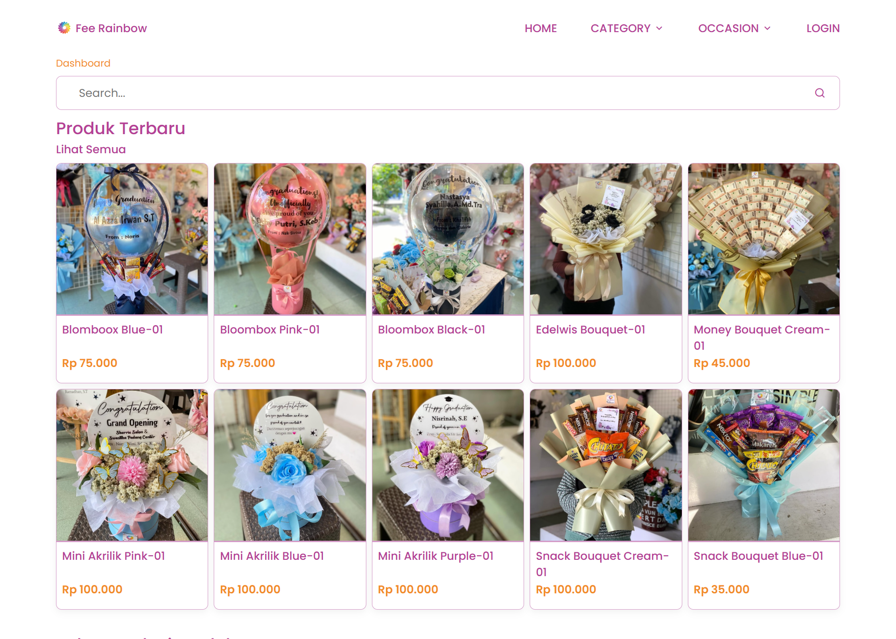
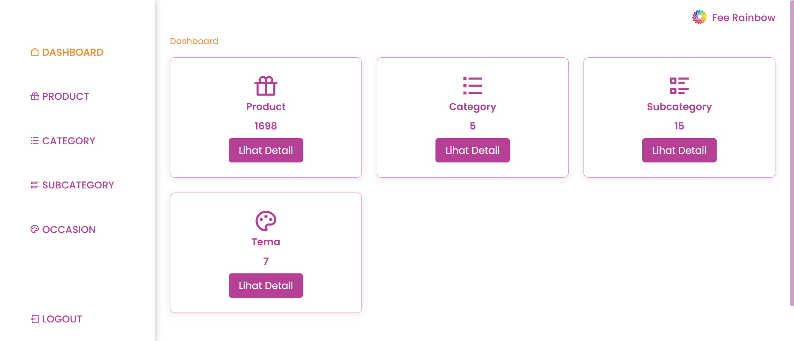

# 🌈 Fee Rainbow — Website Toko Buket Online (PHP Procedural)

> 📥 **Ingin mendapatkan file lengkap proyek ini?**  
> 👉 **[Klik di sini untuk mengakses file](https://sfl.gl/ED7QRvFI)** atau  
> ✉️ **[Hubungi saya langsung melalui GitHub](https://github.com/siegrin)**

<p align="center">
  <a href="https://github.com/siegrin/Fee-Rainbow">
    
  </a>
  <a href="https://github.com/siegrin/Fee-Rainbow/commits/main">
    
  </a>
  <a href="https://github.com/siegrin/Fee-Rainbow">
    
  </a>
  <a href="https://github.com/siegrin/Fee-Rainbow/issues">
    
  </a>
  <a href="https://github.com/siegrin/Fee-Rainbow/stargazers">
    
  </a>
  <a href="https://github.com/siegrin/Fee-Rainbow/network/members">
    
  </a>
  <a href="https://github.com/siegrin/Fee-Rainbow/blob/main/LICENSE">
    
  </a>
  <a href="https://github.com/siegrin/Fee-Rainbow">
    
  </a>
</p>

**Fee Rainbow** adalah website katalog dan manajemen toko buket yang dikembangkan menggunakan PHP native/prosedural. Website ini dibuat karena sebelumnya **sepupu saya belum memiliki website** untuk usaha bouquet-nya. Saya membangun website ini sebagai bagian dari proses belajar, dengan bantuan teknologi AI, namun saya tetap memahami kode yang digunakan dan terus melakukan eksperimen sendiri.

---

## 🎯 Tujuan & Latar Belakang

- Membantu keluarga (sepupu) yang belum memiliki sistem penjualan digital
- Belajar membangun sistem web dari nol menggunakan PHP procedural tanpa framework
- Melatih pemahaman terhadap pengolahan data MySQL, sistem login, dan struktur web modular
- Menggunakan bantuan AI sebagai pendamping belajar, namun tetap menulis dan memahami logika sendiri

---

## 🔧 Fitur Website

- Autentikasi Admin (Login & Logout)
- **CRUD Produk Buket** (gambar, nama, harga, kategori, subkategori, dan occasion)
- Manajemen Data Kategori, Subkategori, dan Occasion
- Upload & Tampilan Gambar Produk
- Tampilan Katalog Produk untuk Pengunjung
- Panel Admin Sederhana dan mudah dikembangkan

---

## 🚀 Live Demo

### 🧪 Versi Awal — Eksperimen Awal

- 🔗 **Katalog Produk (v1):** [Lihat Katalog (v1)](http://katalogbuketnue.infinityfreeapp.com)

- 🔐 **Login Admin (v1):** [Login Admin (v1)](http://katalogbuketnue.infinityfreeapp.com/admin/index.php?page=login)
  - Username: `admin1234`
  - Password: `admin1234`

### ⚙️ Versi Pengembangan — Telah Dikembangkan

- 🔗 **Katalog Produk (v2):** [Lihat Katalog (v2)](https://fee-rainbow.42web.io/)

> 🔒 _Akses admin tidak dibuka untuk publik pada versi ini._

### 👥 Login Demo Publik

- 🔓 **Login Demo User:** [Demo User](https://onlinestoreeverthingur.infinityfreeapp.com/)
- 🔐 **Login Admin (v2):** [Demo Admin](https://onlinestoreeverthingur.infinityfreeapp.com/login)
  - Username: `admin1234`
  - Password: `admin1234`

> _💡 Silakan gunakan akun demo jika hanya ingin mencoba fitur dasar. Data dapat direset sewaktu-waktu._

---

## 🧰 Teknologi yang Digunakan

- PHP Native (Procedural)
- MySQL
- HTML5 + CSS3
- JavaScript

---

## 📂 Struktur Folder

```bash
Fee-Rainbow/
├── admin/              # Panel admin (controllers, models, views)
├── app/                # Tampilan frontend & controller untuk pengguna
├── config/             # File konfigurasi database
├── assets/             # Aset seperti CSS, JS, dan ikon
├── uploads/            # penyimpanan gambar produk otomatis
└── index.php           # Entry point homepage
```

## 📦 Cara Menjalankan Proyek

1. Clone repo ini:
   ```bash
   git clone https://github.com/siegrin/Fee-Rainbow.git
   ```
2. Jalankan web server lokal (XAMPP)

3. Import file database .sql ke phpMyAdmin

4. Konfigurasi config/database.php sesuai pengaturan lokal

5. Akses melalui browser: http://localhost/Fee-Rainbow

## 📷 Preview Antarmuka

Berikut tampilan antarmuka dari website **Fee Rainbow**:

<p align="center">
  
</p>

<p align="center">
  
</p>

---

## 📥 Kontak & Update

Jika Anda tertarik dengan proyek ini atau ingin melihat update terbarunya:

- Hubungi saya melalui GitHub: [@siegrin](https://github.com/siegrin)
- Versi terbaru akan diumumkan secara berkala di halaman repo ini

---

## 🤝 Kontribusi

Kontribusi, kritik, atau masukan sangat diterima!  
Silakan ajukan [Issue](https://github.com/siegrin/Fee-Rainbow/issues) atau kirim [Pull Request](https://github.com/siegrin/Fee-Rainbow/pulls).


---

## 📖 Catatan Pribadi

Website ini adalah hasil kerja keras mandiri yang saya bangun sambil belajar, bereksperimen, dan memahami setiap baris kode yang ditulis. Teknologi AI digunakan sebagai alat bantu eksplorasi dan pendamping belajar — bukan sebagai pengganti logika atau pemahaman.  
Saya berharap proyek ini dapat terus berkembang dan menjadi inspirasi bagi pembuat website pemula lainnya.

---

## 🪪 Lisensi

Proyek ini bersifat pribadi namun terbuka untuk digunakan kembali dalam konteks:

- 📚 Pembelajaran mandiri atau kelas
- 🎓 Tugas akhir, laporan PKL, atau skripsi
- 🛒 Prototipe usaha kecil seperti toko buket, florist, dll

Silakan fork dan modifikasi sesuai kebutuhan Anda.

---

## 📈 Statistik GitHub

<p align="center">
  
  
</p>

---

## ⭐ Dukung Proyek Ini

Jika kamu merasa terbantu, terinspirasi, atau sekadar ingin mendukung:

**→ Beri bintang ⭐ di repository ini!**

Itu sangat berarti dan menjadi motivasi besar untuk terus belajar dan berbagi.  
Terima kasih atas kunjungannya, semoga bermanfaat! 🌸

---